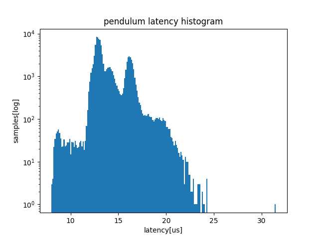

Related with [Provide HW for the performance testing](https://github.com/ros-realtime/community/issues/3), we record supplemental setup information.
We plan to setup RPi4. We write this document as preliminary survey of RPi4 manual.


## Short summary
First, we get and build the foxy 1.0.0.
Second, we run pendulum_demo (That's just for starters).
Third, we try to build buildfarm_perf_tests but we cannot because of insufficient memory. In PC, we use about 3 GB to build, or 1 GB to run buildfarm_perf_tests. Considering the operating system and some margin, we'll need 4 GB to build, or 2 GB to run..


## Get source
To reproduce test results, we should use the same codes.
According to [Building ROS 2 on Linux](https://index.ros.org/doc/ros2/Installation/Crystal/Linux-Development-Setup/), we get the latest codes.
So we retrieve codes from github release tag.

```
wget https://github.com/ros2/ros2/archive/release-foxy-20200605.zip
unzip release-foxy-20200605.zip
cd ros2-release-foxy-20200605
vcs import src < ros2.repos
```

When `vcs import`, we see many messages about `detached HEAD`. This is an example.

```
Cloning into '.'...
Note: checking out '2.3.2'.

You are in 'detached HEAD' state. You can look around, make experimental
changes and commit them, and you can discard any commits you make in this
state without impacting any branches by performing another checkout.

If you want to create a new branch to retain commits you create, you may
do so (now or later) by using -b with the checkout command again. Example:

  git checkout -b <new-branch-name>

HEAD is now at 694a6fe 2.3.2
```

## Build the code in the workspace
Suppose we have already done the followings according to the foxy install manual:

- Set locale
- Add the ROS 2 apt repository
- Install development tools and ROS tools
- Install dependencies using rosdep

This is the build commands. We may not need `-latmic` in RPi4.

```
touch src/ros-visualization/COLCON_IGNORE src/ros2/rviz/COLCON_IGNORE
colcon build --symlink-install  --packages-skip-build-finished --continue-on-error --cmake-args "-DCMAKE_SHARED_LINKER_FLAGS='-latomic'" "-DCMAKE_EXE_LINKER_FLAGS='-latomic'"
```

We see many warnings about GCC 7.1, for example:

```
/usr/include/c++/8/bits/stl_uninitialized.h:99:9: note: parameter passing for argument of type ‘__gnu_cxx::__normal_iterator<const long long unsigned int*, std::vector<long long unsigned int> >’ changed in GCC 7.1
```

And we fail to build ros1_bridge

```
Starting >>> ros1_bridge
  [Processing: ros1_bridge]
  [Processing: ros1_bridge]
  [Processing: ros1_bridge]
  --- stderr: ros1_bridge
  CMake Warning at CMakeLists.txt:34 (message):
    Failed to find ROS 1 roscpp, skipping...
```

## pendulum_demo
```
sudo su -
. install/local_setup.bash
taskset -c 1 ./build/pendulum_control/pendulum_demo -d 200mb -i 100000 -f pendulum.txt
Writing results to file: pendulum.txt
Initial major pagefaults: 0
Initial minor pagefaults: 71812
rttest statistics for pendulum.txt:
  - Minor pagefaults: 0
  - Major pagefaults: 0
  Latency (time after deadline was missed):
    - Min: 7961 ns
    - Max: 1974464 ns
    - Mean: 14049.551050 ns
    - Standard deviation: 131.175455


PendulumMotor received 93692 messages
PendulumController received 96886 messages
```

A large max value is due to a first few loop.

```
$ cut -d" " -f 3 pendulum.txt| head
latency
205215
1974464
1527918
767092
48194
19004
28148
15730
16437
```

Effective max/min values are the followings:

```bash
$ cut -d" " -f 3 pendulum.txt| sort -n | head
latency
7961
8036
8062
8080
8144
8178
8181
8199
8206

$ cut -d" " -f 3 pendulum.txt| sort -nr | head
1974464
1527918
767092
205215
48194
31489
28148
24271
24260
24245
```

This is a latency histogram. Average latency is about 15 [us], amd maximum is ~35 [us]. These values are similar to nanosleep latency in https://github.com/hsgwa/ros2_timer_latency_measurement.
Be aware, **the first four values are omitted** since they look to be affected by initialization.



## buildfarm_perf_tests (failed due to insufficient memory)
As bellow, we cannot build buildfarm_perf_tests on RPi3 because of insufficient memory.
We need at least 4GB RAM to build buildfarm_perf_tests, or 2GB to run buildfarm_perf_tests according to our PC environment (in PC, we need 3GB to build, and 1 GB to run).


## get code
As we cannot get specific version just like ROS2 foxy, we try to compile the latest codes.

```
mkdir -p buildfarm/src
cd buildfarm
wget https://github.com/ros2/buildfarm_perf_tests/raw/master/tools/ros2_dependencies.repos
vcs import src < ros2_dependencies.repos
```

## build

```
sudo pip3 install pandas matplotlib
sudo apt-get install default-jre libboost-all-dev

colcon build --symlink-install
# c++: fatal error: Killed signal terminated program cc1plus
# compilation terminated.
# make[2]: *** [CMakeFiles/perf_test.dir/build.make:107: CMakeFiles/perf_test.dir/src/data_running/data_runner_factory.cpp.o] Error 1
# make[1]: *** [CMakeFiles/Makefile2:598: CMakeFiles/perf_test.dir/all] Error 2
# make: *** [Makefile:141: all] Error 2
# ---
# Failed   <<< performance_test   [ Exited with code 2 ]

dmesg
# Out of memory: Kill process 1933 (cc1plus) score 856 or sacrifice child
# Killed process 1933 (cc1plus) total-vm:932184kB, anon-rss:847140kB, file-rss:0kB, shmem-rss:0kB
```
